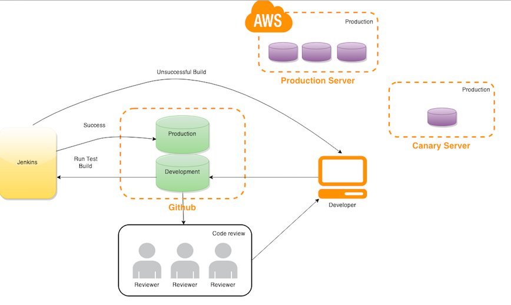

#Special MileStone for DevOps

##Continuous Integration Pipeline

###Jenkins Configuration

###Rspec & Cucumber

####Rspec

####Cucumber
Cucumber is a flagship Behavior Driven Development (BDD) tool. Behavior Driven Development (BDD) is a rising methodology to test and check your code. In BDD, whatever developers write must go into Given-When-Then steps, and thus covers all possible test cases and can be easily modified to accommodate more. 

Executing a Cucumber test scenario requires two files. Feature file contains high level description of the test scenario in simple language. Step definition file contains the actual code to execute the test scenario in the Features file.

An example feature file:

	Feature: Home Dashboard 
  
		Scenario: Jobseeker Login
			Given I'm on the home page
			When I go to Job Seeker Login
			Then I should see Emails and Password are required to log in as a job seeker

An example step file:

	Given /^I'm on the home page$/ do
		visit ('/')
	end
	When /^I go to Job Seeker Login$/ do
  		visit ('/users/sign_in')
	end
	Then /^I should see Emails and Password are required to log in as a job seeker$/ do
		page.should have_content("Job Seeker Log in")
		page.should have_content("Email")
		page.should have_content("Password")
		page.should have_content("Log in")
	end

####Test Coverage 
We have used the SimpleCov to see the project coverage for our project. To run this ruby gem, you need to do the following.
1. Add SimpleCov to your Gemfile and bundle install:

		gem 'simplecov', :require => false, :group => :test
2. Load and launch SimpleCov at the very top of the spec_helper.rb and it will check the coverage of the code. 

		require 'simplecov'
		SimpleCov.start

3. Add some folders which you want it should be excluded in the test report
	
		SimpleCov.start do
		  add_filter "/features/"
		end
		
4. Once you run the Rspec test, it will automatically generate the coverage report.Open Coverage by running.
		
		open coverage/index.html
# Previous content of test helper now starts here

###Static Analysis Tool

We have used rubocop for the static analysis for our ruby project. Include the following in the Gemfile.

	gem 'rubocop', require: false

Run the static analysis tool by run
	
	rubocop
	
You will get the result like this.

		app/models/job.rb:1:1: C: Missing top-level class documentation comment.
		class Job < ActiveRecord::Base
		^^^^^
		app/models/job.rb:2:3: C: Prefer the new style validations validates :column, presence: value over validates_presence_of.
		  validates_presence_of :name,:content,:field,:employer_name,:deadline,:tag
		  ^^^^^^^^^^^^^^^^^^^^^
		app/models/job.rb:2:30: C: Space missing after comma.
		  validates_presence_of :name,:content,:field,:employer_name,:deadline,:tag
		                             ^
		app/models/job.rb:2:39: C: Space missing after comma.
		  validates_presence_of :name,:content,:field,:employer_name,:deadline,:tag
		                                      ^
		app/models/job.rb:2:46: C: Space missing after comma.
		  validates_presence_of :name,:content,:field,:employer_name,:deadline,:tag
		                                             ^
		app/models/job.rb:2:61: C: Space missing after comma.
		  validates_presence_of :name,:content,:field,:employer_name,:deadline,:tag
		                                                            ^
		app/models/job.rb:2:71: C: Space missing after comma.
		  validates_presence_of :name,:content,:field,:employer_name,:deadline,:tag
		                                                                      ^
		app/models/job.rb:3:28: C: Space missing after comma.
		  has_many :jobapplications,dependent: :destroy
		
####

###Code Review
##### ReviewBoard
Review Board is a tool for reviewing source code, documentation and other text-based files. It offers a powerful web-based interface with broad browser support for managing review requests and reviewing code, as well as command line tools to simplify the review request submission process.

In this project, we config ReviewBoard to support post-commit review. Post-commit review is where the code is reviewed after going into the codebase. The code is committed to the repository and, at some point later, the code is reviewed. Any fixes that need to be made are then committed again later.

