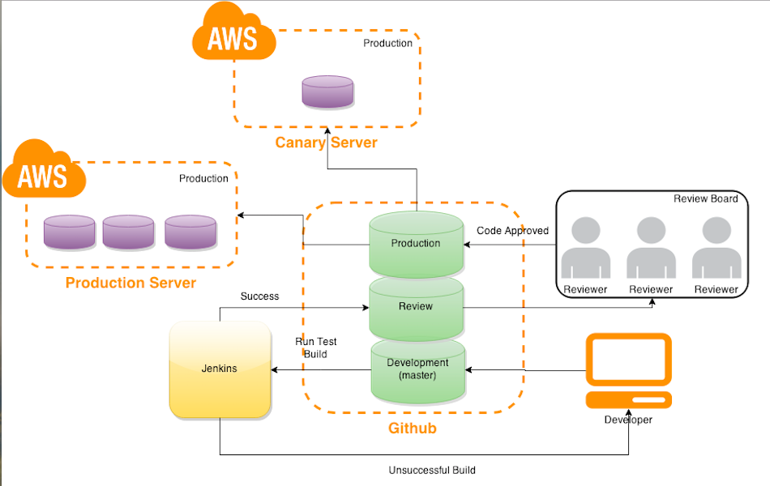
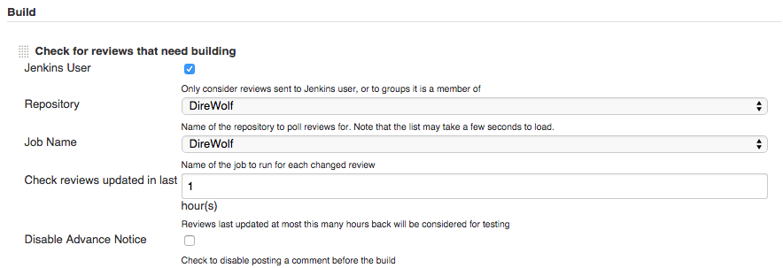
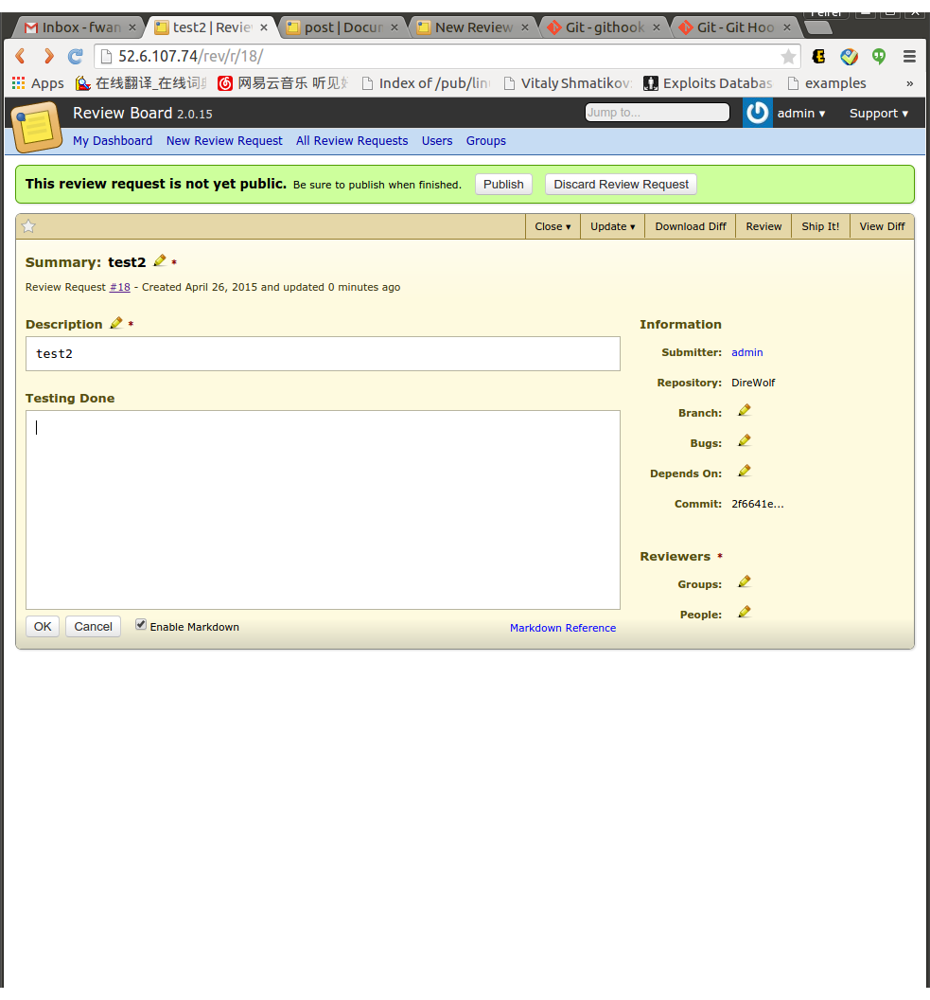
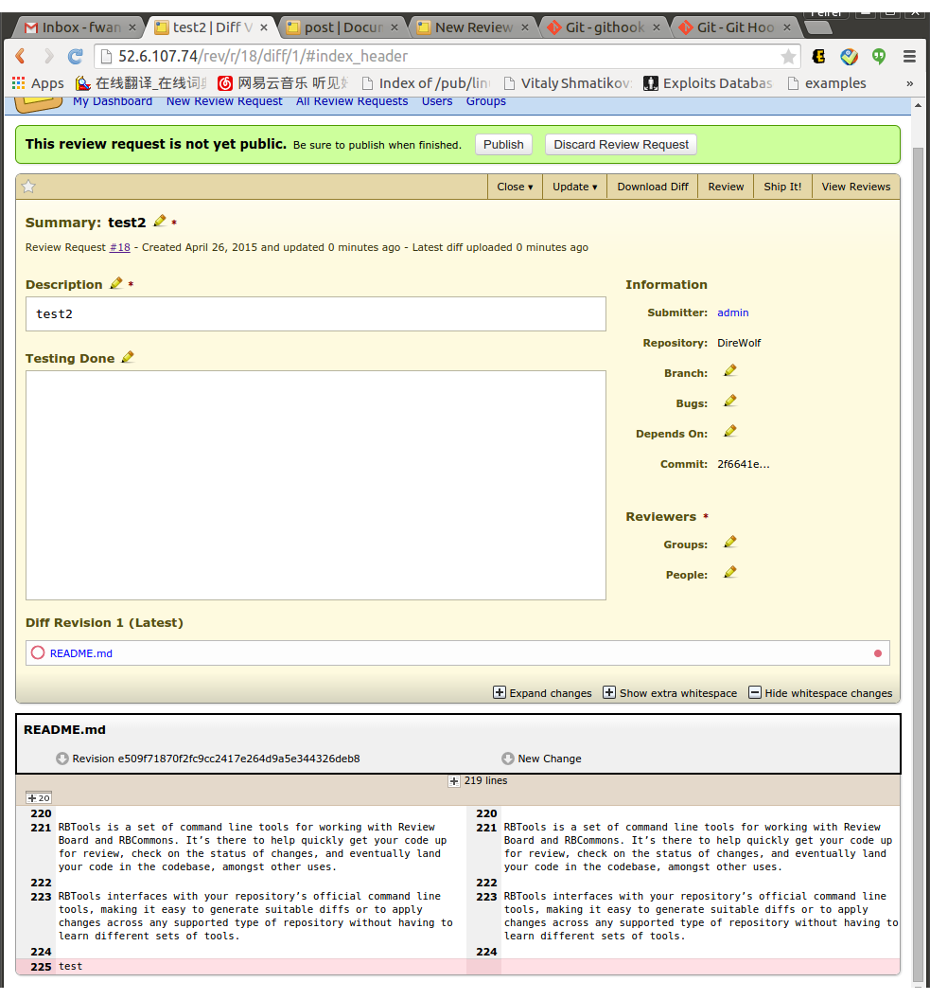

#Special MileStone(Code Review Tool with Reviewboard)

 Shiqian Xu(sxu11), Feifei Wang(fwang12)

##Continuous Integration Pipeline
In the special milestone, we integrate a code review component by using ReviewBoard in the pipeline. The overview is shown as below:

The pipeline is composed of 4 parts:
* A developer makes changes to a develop branch
* The changes is built and tested in Jenkins
* If the change passes the test, it will be pushed into the production branch; otherwise, it is declined
* The changes is also reviewed by code reviewers

Later on we decide to modify our system design to make the code review at the staging phase.

1. The developer will push the code into the development branch
2. Jenkins will monitor the development branch and trigger the build and automatic test.
3. The code which passes the test will be pushed to the review branch. 
4. Reviewboard is able to monitor the review branch and distribute the code to reviewers for review.
5. After some time(staging period), the code on the review branch will be pushed to the production branch.
6. Production server and canary server will be able to get the code from the production branch.
7. (*We are thinking to add another Jenkins server to build the code after code review. However, for our project, we haven't implemented it as it will be unnecessary to do that as code review in our project won't change many code, but in a real project, it may be a good way to implement it*)

###Jenkins Configuration

#### Code Review 
We have used the plugin in Jenkins called ReviewBot which will help us to monitor the status of the ReviewBoard, a code review system, which we will illustrated later. The plugins will help us detect if there are some new reviews which needs to be put into the build.

####Post-build Git Publisher
Other github hook, we have added a git publisher plugin into the jenkins. Once the build is successful, Jenkins will push the repo into the **production** branch. After that, the Production server would be able to run the newest build release.
We have also added a tag to track the build, which can be seen in our repo.

###Rspec & Cucumber

Behavior Driven Development (BDD) is a rising methodology to test and check your code. In BDD, whatever developers write must go into Given-When-Then steps, and thus covers all possible test cases and can be easily modified to accommodate more. 

####Rspec

We have used Rspec for our Unit Test. We can simply write test like below. As Test Driven Development and Bahavior Driven Development Tool, we would first see the red fail test and modify the code to make them change to green. We can simply write the natural language test like the following.

		require 'rails_helper'

		RSpec.describe Job, type: :model do
		  it 'is a valid job' do
		    expect(build(:job)).to be_valid
		  end
		  it 'is invalid without a employer_name' do
		    expect(build(:job,employer_name:nil)).to_not be_valid
		  end
		  describe '#outdated'
		  it 'returns true if time now is larger than deadline' do
		    expect(build(:job,deadline:"2014-09-09").outdated).to be true  
		  end
  
		  it 'returns false if time now is smaller than deadline' do
		    expect(build(:job,deadline:"2015-09-09").outdated).to be false
		  end
		end
		

####Cucumber
Cucumber is a flagship Behavior Driven Development (BDD) tool. 

Executing a Cucumber test scenario requires two files. Feature file contains high level description of the test scenario in simple language. Step definition file contains the actual code to execute the test scenario in the Features file.

An example feature file:

	Feature: Home Dashboard 
  
		Scenario: Jobseeker Login
			Given I'm on the home page
			When I go to Job Seeker Login
			Then I should see Emails and Password are required to log in as a job seeker

An example step file:

	Given /^I'm on the home page$/ do
		visit ('/')
	end
	When /^I go to Job Seeker Login$/ do
  		visit ('/users/sign_in')
	end
	Then /^I should see Emails and Password are required to log in as a job seeker$/ do
		page.should have_content("Job Seeker Log in")
		page.should have_content("Email")
		page.should have_content("Password")
		page.should have_content("Log in")
	end

####Test Coverage 
We have used the SimpleCov to see the project coverage for our project. To run this ruby gem, you need to do the following.
1. Add SimpleCov to your Gemfile and bundle install:

		gem 'simplecov', :require => false, :group => :test
2. Load and launch SimpleCov at the very top of the spec_helper.rb and it will check the coverage of the code. 

		require 'simplecov'
		SimpleCov.start

3. Add some folders which you want it should be excluded in the test report
	
		SimpleCov.start do
		  add_filter "/features/"
		end
		
4. Once you run the Rspec test, it will automatically generate the coverage report.Open Coverage by running.
		
		open coverage/index.html

###Static Analysis Tool

We have used rubocop for the static analysis for our ruby project. Include the following in the Gemfile.

	gem 'rubocop', require: false

Run the static analysis tool by run
	
	rubocop
	
You will get the result like this.

		app/models/job.rb:1:1: C: Missing top-level class documentation comment.
		class Job < ActiveRecord::Base
		^^^^^
		app/models/job.rb:2:3: C: Prefer the new style validations validates :column, presence: value over validates_presence_of.
		  validates_presence_of :name,:content,:field,:employer_name,:deadline,:tag
		  ^^^^^^^^^^^^^^^^^^^^^
		app/models/job.rb:2:30: C: Space missing after comma.
		  validates_presence_of :name,:content,:field,:employer_name,:deadline,:tag
		                             ^
		app/models/job.rb:2:39: C: Space missing after comma.
		  validates_presence_of :name,:content,:field,:employer_name,:deadline,:tag
		                                      ^
		app/models/job.rb:2:46: C: Space missing after comma.
		  validates_presence_of :name,:content,:field,:employer_name,:deadline,:tag
		                                             ^
		app/models/job.rb:2:61: C: Space missing after comma.
		  validates_presence_of :name,:content,:field,:employer_name,:deadline,:tag
		                                                            ^
		app/models/job.rb:2:71: C: Space missing after comma.
		  validates_presence_of :name,:content,:field,:employer_name,:deadline,:tag
		                                                                      ^
		app/models/job.rb:3:28: C: Space missing after comma.
		  has_many :jobapplications,dependent: :destroy
		
###Monitor

We have used the Monitoring plugin in Jenkins to monitor our server. The plugins offers lots of details of the system as a whole. You can check it at

	 http://52.6.107.74:8080/monitoring

###Code Review
#### ReviewBoard
Review Board is a tool for reviewing source code, documentation and other text-based files. It offers a powerful web-based interface with broad browser support for managing review requests and reviewing code, as well as command line tools to simplify the review request submission process.

In this project, we config ReviewBoard to support post-commit review. Post-commit review is where the code is reviewed after going into the codebase. The code is committed to the repository and, at some point later, the code is reviewed. Any fixes that need to be made are then committed again later.

##### Add Repositories

Click the Add link next to the Repositories entry in the database section or the Administrator Dashboard. Fill in:

	Name: DireWolf
	Hosting service: GitHub
	Account: Jessexu20
	Repository type: Git
	Repository plan: Public
	Repository name: DireWolf

##### Review Code
When a developer makes a commit, the commit will show at admin page, as shown in the following screenshot

Admin can assign another developer to review it, e.g., feifei, as shown in the following screenshot

Then I log in as "feifei" - the specified reviewer, and I can see the diff, as shown in the following screenshot

And "feifei" can make comment, e.g., "test test test", as shown in the following screenshot

The comment will show in "admin", as shown in the following screenshot

You can also download the diff file, as the tab in the following screenshot shown

You can also ship it, as the tab in the following screenshot shown

You can also update diff, as the tab in the following screenshot shown

You can also view diff, as the tab in the following screenshot shown

##### Automate the Process

RBTools is a set of command line tools for working with Review Board and RBCommons. It’s there to help quickly get your code up for review, check on the status of changes, and eventually land your code in the codebase, amongst other uses.

RBTools interfaces with your repository’s official command line tools, making it easy to generate suitable diffs or to apply changes across any supported type of repository without having to learn different sets of tools.

In this milestone, we add hooks to automatically request for review when a commit is made in the repository.

In the repository

	rbt setup-repo

In .git/hooks

	vim post-commit
	rbt post --username=admin --password=123456 --submit-as=admin

Then when I commit this repository, I can see the review request

And I can view the diff file

